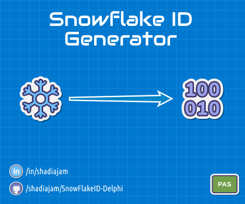

# Snowflake IDs for Delphi

> Snowflake's unique identifier generation system is a method of generating unique identifiers for objects within a distributed system or database.

[](https://github.com/shadiajam)

### [Usage](#usage) | [Examples](#examples)

## Why you need it!?

In distributed systems, generating unique identifiers is crucial for tracking and managing entities across multiple machines. Using a snowflake ID approach ensures that IDs are system unique rather than globally unique, minimizing conflicts in high-volume environments, AND **it's sortable**.

### Snowflake Components Usage

* **Timestamp:** Represents the time when the ID was generated, facilitating chronological ordering.
* **MachineID:** Serves as a sender ID, identifying the specific machine or instance that generated the ID, ensuring system uniqueness.
* **Sequence:** Functions as an acknowledgment counter, incrementing with each ID generated, allowing multiple IDs to be created without collision.

This design fits within a 64-bit integer **(Int64)**.

### Companies Using Snowflake IDs

Several companies have adopted Snowflake IDs for efficient ID generation:

* **Twitter**: Utilized Snowflake IDs for unique identifiers in their tweet and user systems, enabling scalability and efficient data indexing.
* **Instagram**: Employed Snowflake IDs for photos and user accounts, ensuring unique content identification and efficient database operations.
* **Uber**: Implemented Snowflake IDs for trips and drivers, supporting global scalability and efficient data tracking across their systems.
* **Airbnb**: Used Snowflake IDs for listings and bookings, achieving global uniqueness and reliable inventory management.
* **GitHub**: Leveraged Snowflake IDs for repositories and issues, ensuring unique identification and smooth navigation for developers.

## Usage

1. **Clone or simply download the unit**: Clone the repository or download the `SFID.pas` unit to your Delphi project.
2. **Start using it**: Assign new variable from `TSFID`, create new ID `TSFID.NewSfid`.
3. **Please give it a 🌟 and share it with others**

## Examples

### Example: Simple generate SnowFlake ID

```delphi
uses
    SFID;

var
    Sfid: TSFID;
begin
    // Create a new Snowflake ID with the current timestamp, default machine ID, and a new sequence
    Sfid := TSFID.NewSfid;

    // Get Unique ID as int64 base
    WriteLn('Snowflake ID as Integer: ', Sfid.AsInt);

    // Access components of the Snowflake ID
    WriteLn('Timestamp: ', Sfid.Timestamp);
    WriteLn('Machine ID: ', Sfid.MachineID);
    WriteLn('Sequence: ', Sfid.Sequence);
end;
```

## Author

* **Shadi Ajam**  

  [](https://github.com/shadiajam)
  [](https://www.linkedin.com/in/shadiajam/)

## Useful Unit, Right?

YES! We’d love your support! Please give it a 🌟 and share it with others.

**Share on social media**:

<a href="https://www.linkedin.com/sharing/share-offsite/?url=https://github.com/shadiajam/SnowFlakeID-Delphi" target="_blank">
  
</a>
<a href="https://dev.to/new?url=https://github.com/shadiajam/SnowFlakeID-Delphi" target="_blank">
  
</a>
<a href="https://twitter.com/intent/tweet?text=Check%20out%20this%20awesome%20repository%20on%20GitHub%21&url=https://github.com/shadiajam/SnowFlakeID-Delphi" target="_blank">
  
</a>
<a href="https://reddit.com/submit?url=https://github.com/shadiajam/SnowFlakeID-Delphi&title=Check%20out%20this%20awesome%20repository%20on%20GitHub%21" target="_blank">
  
</a>
<a href="https://www.facebook.com/sharer/sharer.php?u=https://github.com/shadiajam/SnowFlakeID-Delphi" target="_blank">
  
</a>